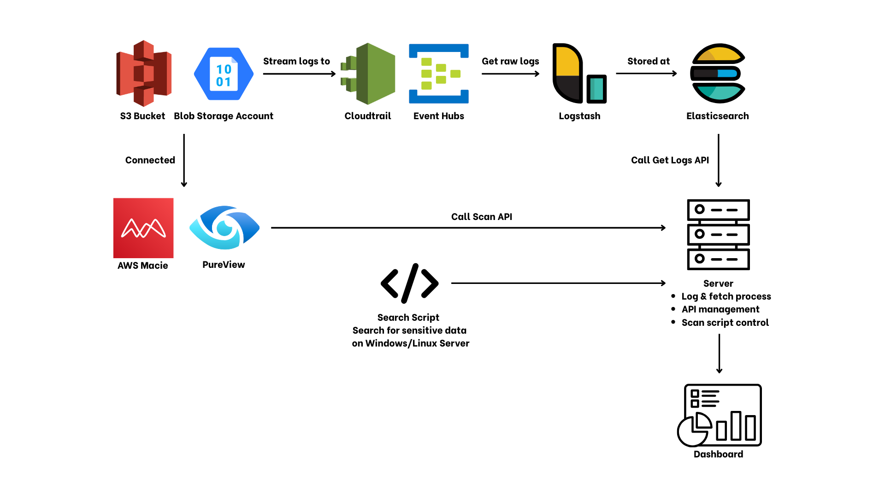

# Data Security Posture Management on Cloud Storage

---

<!-- ## 📚 Table of Contents
- [Description](#-description)
- [Architecture](#-architecture)
- [Main Component Overview](#-main-component-overview)

--- -->

## <!--📝--> Description

This project is a **Data Security Posture Management (DSPM)** platform designed to operate across two major cloud storage services: **Azure Blob Storage** and **AWS S3**. The platform offers the following key features:

- **Log Management**: Tracks activities such as file uploads, user modifications (capturing the usernames who made changes), and file downloads.
- **Search and Scan**: Scans cloud storage repositories to identify files containing sensitive information.
- **Server Scan**: Scans Windows and Linux servers to detect files that may contain sensitive data.

The goal of this platform is to enhance visibility, monitoring, and security of data assets across hybrid cloud environments.

---

## <!--📋--> Architecture

_Updating..._

---

## <!--🛠️--> Main Component Overview
| Main Component | Description |
| :------------- | :---------- |
| **🔍 Log Management** | Collects and processes logs from Azure Storage and AWS S3. Extracts essential information like file uploads, downloads, access timestamps, and user actions. |
| **☁️ Cloud Storage Scanner** | Utilizes Microsoft Purview for Azure and Amazon Macie for AWS to scan and detect sensitive data in stored files based on predefined patterns or user-defined keywords. |
| **🖥️ Server Scanner** | Runs scripts on Windows and Linux servers to find sensitive information within file systems. Automatically triggers scans and reports results back to the backend. |
| **🔗 Backend Server** | Handles API workflows, coordinates scan operations, processes raw logs, and provides structured data to the dashboard for visualization and monitoring. |
| **📊 Dashboard** | Centralized UI for managing and visualizing processed logs and scan results. Supports searching, filtering, and real-time monitoring of data security posture across environments. |
